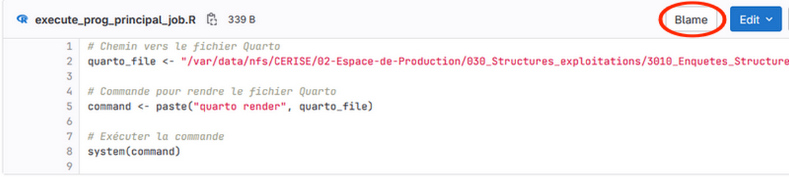

# Découvrir *git-who* : un outil simple pour savoir *qui* a écrit *quoi* dans votre code

Dans la vie d’un projet logiciel collaboratif, une question revient très souvent :  
**« Qui a écrit cette partie du code ? »**  
Que ce soit pour comprendre une logique métier, corriger un bug ou simplement retrouver la bonne personne à contacter, il est utile de pouvoir identifier rapidement l’auteur d’une ligne de code.

Git fournit déjà quelques solutions pour cela, comme la commande `git blame`. Mais son usage peut être un peu verbeux et peu adapté si l’on veut une vue synthétique.  

Avec git blame on peut savoir qui a modifié **chaque ligne de code** mais cela **ne peut s'appliquer que sur un nom de fichier précis**.

- En ligne de commande

```bash
git blame execute_prog_principal_job.R
```

- Ou avec l'IHM de GitHub en clquant sur le bouton "Blame".
  


C’est précisément pour répondre à ce besoin qu’a été créé **git-who**.


