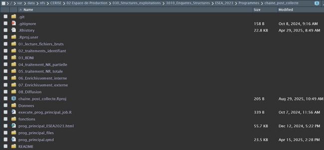

## Qu’est-ce que *git-who* ?

**git-who** est un petit utilitaire en ligne de commande qui permet d’identifier facilement les auteurs de parties précises de votre dépôt Git.  
Son objectif : **simplifier et rendre plus lisible** la recherche d’auteurs, en combinant la puissance de `git log` et `git blame` avec une présentation claire.

Avec git-who, vous pouvez par exemple :  
- retrouver rapidement l’auteur d’une fonction, d’un bloc ou d’une ligne,  
- afficher un résumé des contributeurs sur un fichier,  
- visualiser la répartition des contributions.

---

## Installation

Voir avec Pierre pour une future installation sur Cerise (propre pour tous les utilisateurs) ?

TO DO

## Exemples d’utilisation

Avec le projet :

